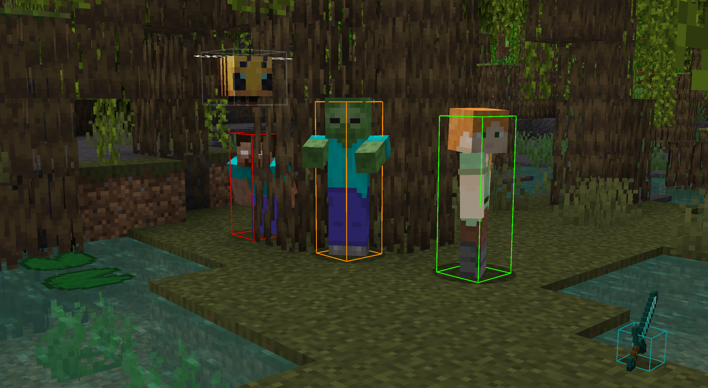
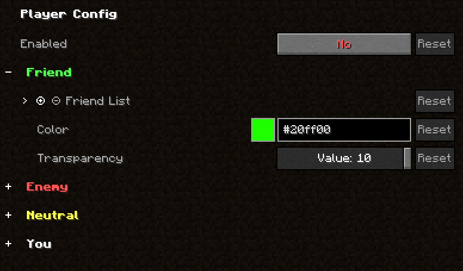
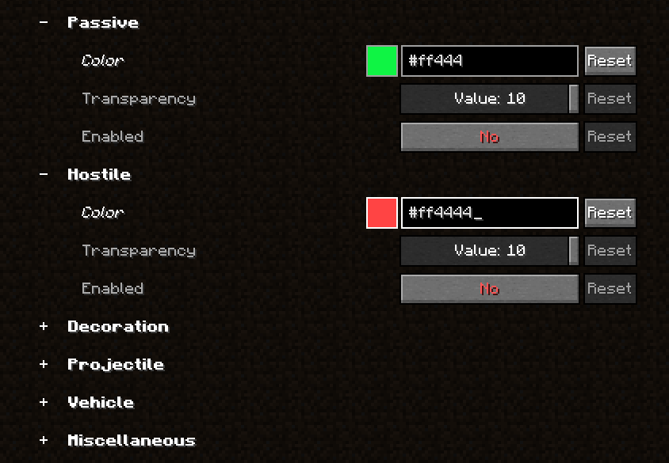

<!-- modrinth_exclude.start -->

<!-- modrinth_exclude.end -->

---
# HitBox+

A mod that allows you to change the color of hitboxes.

## Features

### Friend and Enemy color

### Separate configs for different entity types

# Dependencies

- Mod Menu: https://modrinth.com/mod/modmenu
- Cloth Config: https://modrinth.com/mod/cloth-config